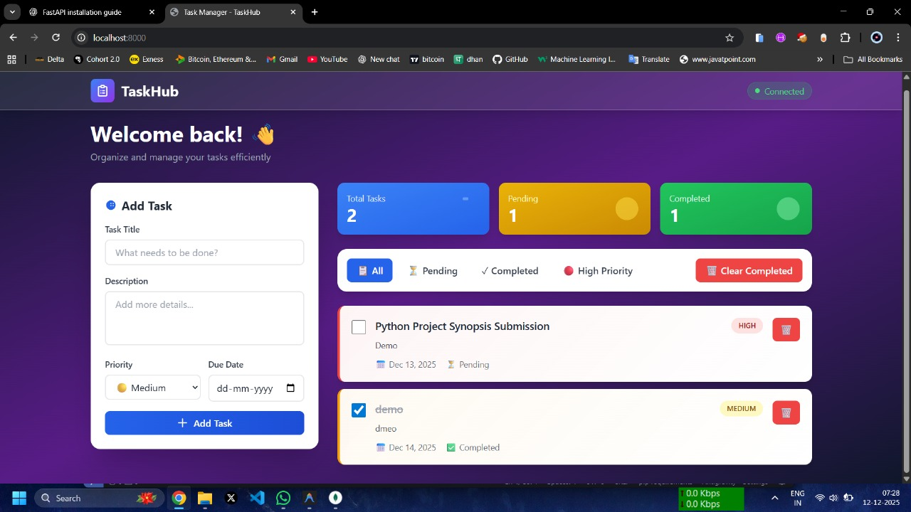
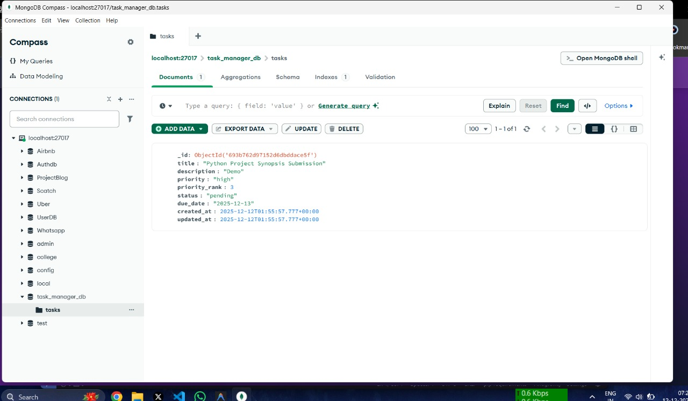

---

```md
# 🗂️ Task Manager Web Application

A modern and user-friendly **Task Management Web Application** designed to help users efficiently create, organize, and track their tasks.  
The application follows a **clean, modular architecture** with a responsive frontend and a robust backend powered by Django and MongoDB.

---

## 📌 Overview

The Task Manager application enables users to manage daily tasks with features such as task creation, status tracking, filtering, and real-time statistics.  
It is built using modern web technologies with a focus on **scalability, maintainability, and usability**.

---

## 📸 Project Screenshots

### Dashboard


### Task Management


### Database (MongoDB)


---

## 🚀 Key Features

- Create tasks with title, description, priority, and due date
- Update and delete existing tasks
- Mark tasks as completed or pending
- Filter tasks by status and priority
- Dashboard with real-time task statistics
- Responsive UI for desktop and mobile devices
- RESTful backend architecture
- Secure and scalable MongoDB integration
- Unified frontend and backend (no CORS issues)

---

## 🛠️ Technology Stack

### Frontend
- HTML5  
- Tailwind CSS  
- JavaScript (Vanilla JS)

### Backend
- Python  
- Django  

### Database
- MongoDB (NoSQL)  
- PyMongo  

### Tools & Utilities
- Git & GitHub  
- Postman  
- Python-dotenv  

---

## 📂 Project Structure

```

task-manager/
├── images/
│   ├── Dashboard.jpeg
│   ├── Tasks.jpeg
│   └── MongoDB.jpeg
├── backend/
│   ├── manage.py
│   ├── app/
│   └── requirements.txt
├── frontend/
│   ├── index.html
│   ├── css/
│   └── js/
└── README.md

````

---

## ⚙️ Installation & Setup

### 1️⃣ Clone the Repository
```bash
git clone https://github.com/VivekGhule/Task_Manger.git
cd Task_Manger
````

### 2️⃣ Create and Activate Virtual Environment

```bash
python -m venv venv
source venv/bin/activate    # Windows: venv\Scripts\activate
```

### 3️⃣ Install Dependencies

```bash
pip install -r requirements.txt
```

### 4️⃣ Configure Environment Variables

Create a `.env` file:

```env
MONGO_URI=your_mongodb_connection_string
SECRET_KEY=your_django_secret_key
```

### 5️⃣ Run the Application

```bash
python manage.py runserver
```

---

## 📈 Future Enhancements

* User authentication and authorization
* Task reminders and notifications
* Role-based access control
* Advanced analytics and reports
* Cloud deployment (AWS / Azure)

---

## 👨‍💻 Author

**Vivek Ghule**

* GitHub: [https://github.com/VivekGhule](https://github.com/VivekGhule)

---

## 📄 License

This project is licensed under the **MIT License**.
You are free to use, modify, and distribute this project.

---

⭐ If you find this project useful, consider giving it a **star** on GitHub.


