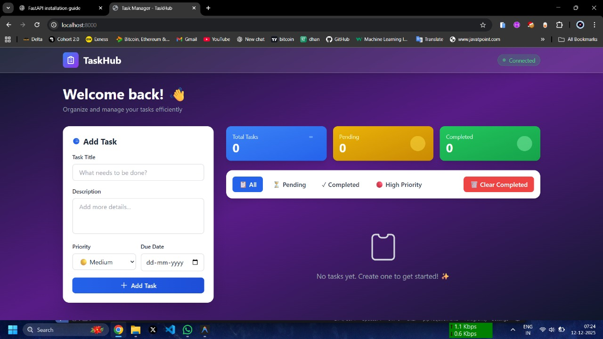

# 🗂️ Task Manager Web Application

A modern and user-friendly **Task Management Web Application** designed to help users efficiently create, organize, and track their tasks.  
The application follows a **clean, modular architecture** with a responsive frontend and a robust backend powered by Django and MongoDB.

---

## 📌 Overview

The Task Manager application enables users to manage daily tasks with features such as task creation, status tracking, filtering, and real-time statistics.  
It is built using modern web technologies with a focus on **scalability, maintainability, and usability**.

---

## 📸 Project Screenshots

### Dashboard
  

### Task Management
 

### Database (MongoDB)
 

---

## 🚀 Key Features

- Create tasks with title, description, priority, and due date
- Update and delete existing tasks
- Mark tasks as completed or pending
- Filter tasks by status and priority
- Dashboard with real-time task statistics
- Responsive UI for desktop and mobile devices
- RESTful backend architecture
- Secure and scalable MongoDB integration
- Unified frontend and backend (no CORS issues)

---

## 🛠️ Technology Stack

### Frontend
- HTML5  
- Tailwind CSS  
- JavaScript (Vanilla JS)

### Backend
- Python  
- Django  

### Database
- MongoDB (NoSQL)  
- PyMongo  

### Tools & Utilities
- Git & GitHub  
- Postman  
- Python-dotenv  

---

## 📂 Project Structure
task-manager/
├── images/
│ ├── Dashboard.jpg
│ ├── Tasks.jpg
│ └── MongoDB.jpg
├── backend/
├── frontend/
└── README.md

